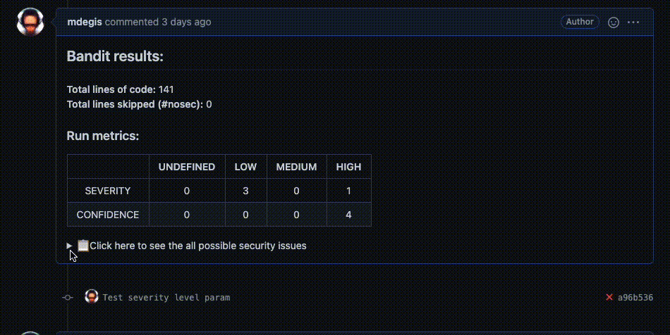

# Bandit Action
From Bandit documentation:

Bandit is a tool designed to find common security issues in Python code. To do this Bandit processes each file, builds an AST from it, and runs appropriate plugins against the AST nodes. Once Bandit has finished scanning all the files it generates a report.

This Github Action will let you use Bandit with the highly configurable parameters that suits your needs.




## Inputs

### `path`

**Optional** The path to run bandit on

**Default** `"."`

### `level`

**Optional** Report only issues of a given severity level or higher.
Can be LOW, MEDIUM or HIGH. Default is UNDEFINED (everything).

**Default** `"UNDEFINED"`

### `confidence`

**Optional** Report only issues of a given confidence level or higher.
Can be LOW, MEDIUM or HIGH. Default is UNDEFINED (everything).

**Default** `"UNDEFINED"`

### `excluded_paths`

**Optional** Comma-separated list of paths (glob patterns supported) to exclude from scan
(note that these are in addition to the excluded paths provided in the config file) (default is from the Bandit itself)

**Default** `".svn,CVS,.bzr,.hg,.git,__pycache__,.tox,.eggs,*.egg"`

### `exit_zero`

**Optional** Exit with 0, even with results found (set `"true"` to use it)

### `skips`

**Optional** Comma-separated list of test IDs to skip

### `ini_path`

**Optional** Path to a .bandit file that supplies command line arguments

### `GITHUB_TOKEN`

**Required** Github token of the repository (automatically created by Github)


## Outputs

No output at the console.

You can see the comment at the PR if there is an at least one issue.

## Example usage
```yml
uses: mdegis/bandit-action@v1.0
with:
  GITHUB_TOKEN: ${{ secrets.GITHUB_TOKEN }}
  path: "."
  level: high
  confidence: high
  exit_zero: true
```
